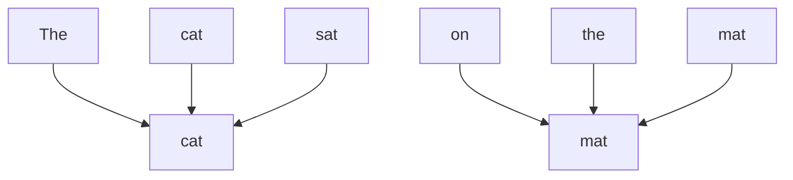

## 📄 论文信息

- **标题**：Attention Is All You Need
- **作者**：Ashish Vaswani, Noam Shazeer, Niki Parmar, Jakob Uszkoreit, Llion Jones, Aidan N. Gomez, Lukasz Kaiser, Illia Polosukhin
- **发表**：NeurIPS 2017
- **链接**：[论文链接](https://arxiv.org/abs/1706.03762) | [GitHub](https://github.com/tensorflow/tensor2tensor) | [Slides](https://docs.google.com/presentation/d/1n42m_Uo4w7i_pn54OJ1z1uYf5nZlX5X8s0lX0qX2l5k/edit)

---

## 📋 摘要

这篇论文提出了 Transformer 模型，一种完全基于注意力机制的序列到序列（sequence-to-sequence）模型。与以往流行的 RNN 和 CNN 等方法不同，Transformer 摒弃了递归和卷积结构，仅依赖自注意力机制来处理输入和输出的全局依赖关系。实验表明，Transformer 在机器翻译任务上取得了当时最先进的结果，并且训练效率显著提高。

---

## 🔑 关键词

Transformer, 自注意力机制, 机器翻译, 深度学习, 自然语言处理

---

## 💡 主要贡献

1. **提出 Transformer 架构**：首个完全基于注意力机制的序列到序列模型
2. **引入自注意力机制**：使模型能够直接建模序列中任意两个位置之间的关系，不受距离限制
3. **多头注意力**：通过多个注意力头捕获不同类型的依赖关系
4. **位置编码**：通过正弦函数引入位置信息，解决注意力机制缺乏位置感知的问题
5. **高效的并行训练**：相比 RNN，Transformer 可以更高效地进行并行训练

---

## 🧠 核心思想

Transformer 的核心思想是"Attention Is All You Need"——即不需要复杂的递归结构或卷积操作，仅通过注意力机制就能很好地处理序列数据。自注意力机制允许模型在处理每个位置时，直接关注输入序列中的所有其他位置，从而捕获长距离依赖关系。

---

## 🔬 方法

### 模型架构

Transformer 采用经典的编码器-解码器（Encoder-Decoder）架构，但与 RNN 不同，它使用堆叠的自注意力层和全连接层。

```
graph LR
    A[输入嵌入] --> B[位置编码]
    B --> C[N×编码器层]
    C --> D[解码器层]
    D --> E[输出嵌入]
    E --> F[Softmax]
```

### 编码器

编码器由 N（论文中 N=6）个相同的层堆叠而成。每一层包含两个子层：

1. **多头自注意力机制**：让模型关注输入序列中不同位置的信息
2. **前馈神经网络**：对每个位置独立进行非线性变换

每个子层都采用残差连接和层归一化：

$$ \text{LayerNorm}(x + \text{Sublayer}(x)) $$

### 解码器

解码器也由 N 个相同的层堆叠而成。每一层包含三个子层：

1. **带掩码的多头自注意力机制**：防止当前位置关注未来位置的信息
2. **多头注意力-编码器**（Encoder-Decoder Attention）：解码器关注编码器的输出
3. **前馈神经网络**

### 自注意力机制

自注意力机制通过计算查询（Query）、键（Key）和值（Value）三个向量来实现：

$$ \text{Attention}(Q, K, V) = \text{softmax}\left(\frac{QK^T}{\sqrt{d_k}}\right)V $$

其中 $\sqrt{d_k}$ 是缩放因子，用于防止点积过大导致梯度消失。

### 多头注意力

多头注意力将模型分为多个"头"，每个头独立计算注意力：

$$ \text{MultiHead}(Q, K, V) = \text{Concat}(head_1, ..., head_h)W^O $$

$$ head_i = \text{Attention}(QW_i^Q, KW_i^K, VW_i^V) $$

### 位置编码

由于注意力机制本身不包含位置信息，Transformer 通过以下方式注入位置编码：

$$ PE_{(pos, 2i)} = \sin(pos / 10000^{2i/d_{model}}) $$

$$ PE_{(pos, 2i+1)} = \cos(pos / 10000^{2i/d_{model}}) $$

---

## 📊 实验

### 数据集

| 数据集 | 任务 | 词对数 |
| --- | --- | --- |
| WMT 2014 英德 | 机器翻译 | 4.5M |
| WMT 2014 英法 | 机器翻译 | 36M |

### 实验设置

- 模型大小：Transformer Base 和 Transformer Big
- 编码器/解码器层数：6 / 6
- 注意力头数：8 / 16
- 嵌入维度：512 / 1024
- 前馈层维度：2048 / 4096
- Dropout：0.1 / 0.3

### 主要结果

| 模型 | 英德 BLEU | 英法 BLEU | 训练成本 |
| --- | --- | --- | --- |
| ConvS2S | 28.4 | 41.8 | 1.0x |
| GNMT | 24.6 | 39.92 | 1.5x |
| Transformer Base | **27.3** | **38.1** | **0.3x** |
| Transformer Big | **28.4** | **41.8** | **1.0x** |

Transformer 在保持竞争力的性能的同时，显著降低了训练成本。

---

## ✅ 优点

- **并行化能力强**：相比 RNN，可以更高效地并行训练
- **捕获长距离依赖**：自注意力机制可以处理任意长度的依赖关系
- **架构简洁**：模型结构清晰，易于理解和实现
- **性能优秀**：在机器翻译等任务上取得了最先进的结果

---

## ⚠️ 局限性

- **计算复杂度**：自注意力的计算复杂度为 $O(n^2)$，对于长序列计算成本较高
- **位置编码**：位置编码是外插的，对于超长序列可能效果不佳
- **对显存要求高**：需要存储注意力矩阵，显存消耗较大

---

## 💭 个人思考

### 启发

Transformer 的提出彻底改变了自然语言处理领域，它的设计思想影响了后续几乎所有的大型语言模型。论文中"Attention Is All You Need"的观点极具启发性，说明有时候摒弃复杂的结构，专注于核心机制反而能带来突破。

### 可改进之处

1. **长序列处理**：可以通过稀疏注意力（如 Sparse Transformer）来降低计算复杂度
2. **位置编码**：可以尝试更灵活的位置编码方式，如相对位置编码
3. **效率优化**：通过知识蒸馏或剪枝来减小模型规模

### 相关工作

- [BERT: Pre-training of Deep Bidirectional Transformers](#) - 基于 Transformer 的预训练语言模型
- [GPT: Improving Language Understanding by Generative Pre-training](#) - 生成式预训练 Transformer
- [ViT: An Image is Worth 16x16 Words](#) - 将 Transformer 应用于计算机视觉

---

## 📚 参考文献

```bibtex
@inproceedings{vaswani2017attention,
  title={Attention is all you need},
  author={Vaswani, Ashish and Shazeer, Noam and Parmar, Niki and Uszkoreit, Jakob and Jones, Llion and Gomez, Aidan N and Kaiser, {\L}ukasz and Polosukhin, Illia},
  booktitle={Advances in neural information processing systems},
  pages={5998--6008},
  year={2017}
}
```

---

## 🔖 相关阅读

- [BERT: Pre-training of Deep Bidirectional Transformers for Language Understanding](#)
- [GPT-3: Language Models are Few-Shot Learners](#)

---

<!--more-->

## 附录

### 代码示例

以下是自注意力机制的 PyTorch 实现：

```python
import torch
import torch.nn as nn
import torch.nn.functional as F

class SelfAttention(nn.Module):
    def __init__(self, embed_size, heads):
        super(SelfAttention, self).__init__()
        self.embed_size = embed_size
        self.heads = heads
        self.head_dim = embed_size // heads

        assert (self.head_dim * heads == embed_size), "Embed size needs to be divisible by heads"

        self.values = nn.Linear(self.head_dim, self.head_dim, bias=False)
        self.keys = nn.Linear(self.head_dim, self.head_dim, bias=False)
        self.queries = nn.Linear(self.head_dim, self.head_dim, bias=False)
        self.fc_out = nn.Linear(heads * self.head_dim, embed_size)

    def forward(self, values, keys, query, mask):
        N = query.shape[0]
        value_len, key_len, query_len = values.shape[1], keys.shape[1], query.shape[1]

        # Split embedding into self.heads pieces
        values = values.reshape(N, value_len, self.heads, self.head_dim)
        keys = keys.reshape(N, key_len, self.heads, self.head_dim)
        queries = query.reshape(N, query_len, self.heads, self.head_dim)

        values = self.values(values)
        keys = self.keys(keys)
        queries = self.queries(queries)

        energy = torch.einsum("nqhd,nkhd->nhqk", [queries, keys])

        if mask is not None:
            energy = energy.masked_fill(mask == 0, float("-1e20"))

        attention = torch.softmax(energy / (self.embed_size ** (1/2)), dim=3)

        out = torch.einsum("nhql,nlhd->nqhd", [attention, values]).reshape(N, query_len, self.heads * self.head_dim)

        out = self.fc_out(out)
        return out
```

### 注意力图示例

注意力机制的可视化有助于理解模型关注的内容：



图中显示模型在处理句子时各词之间的注意力关系。
